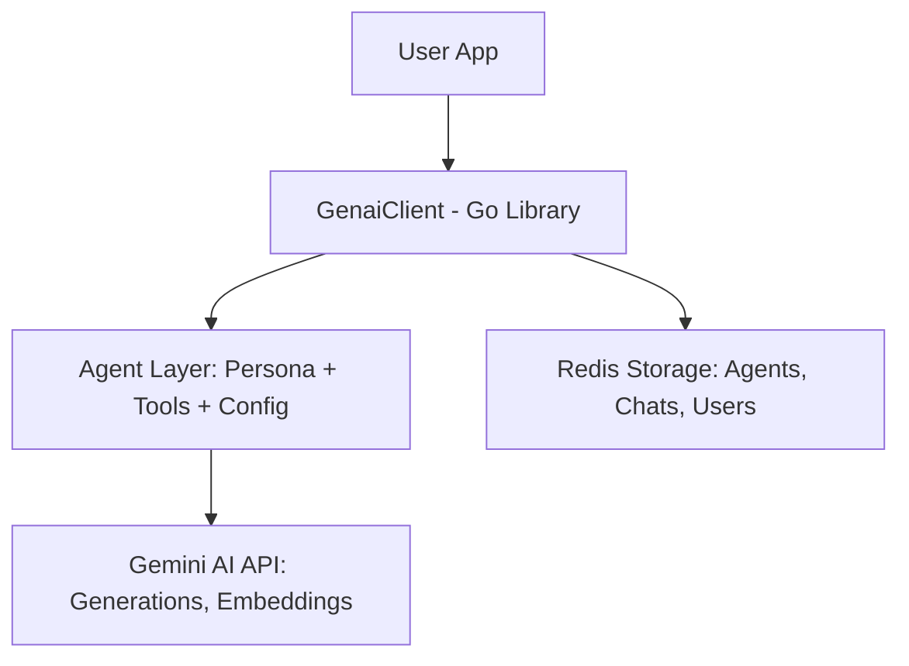
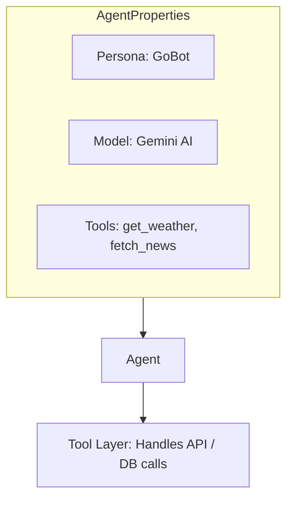
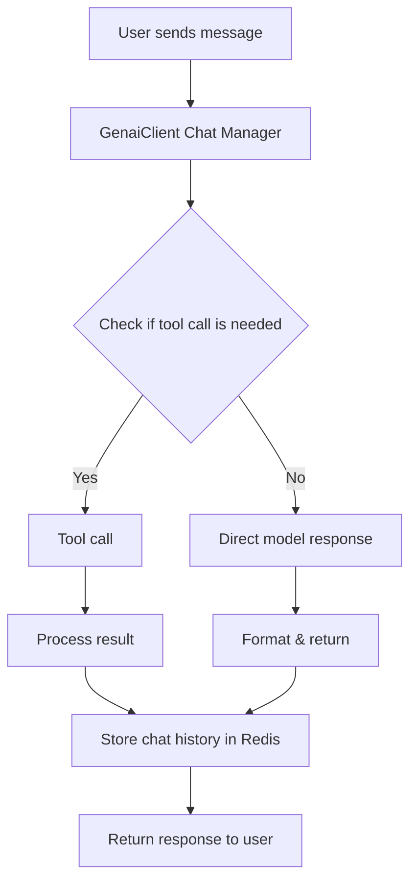
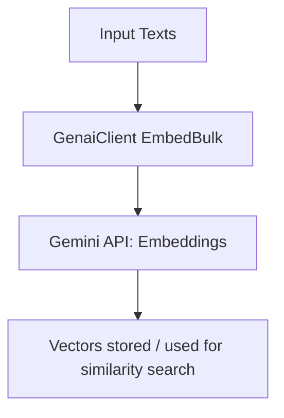
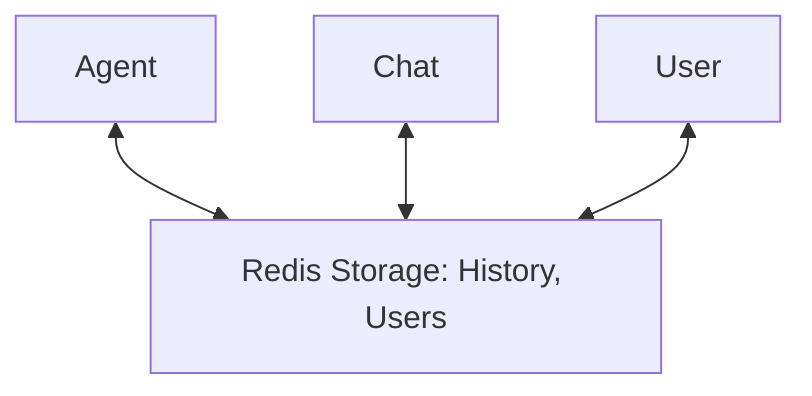

# GenaiClient

**GenaiClient** is a Go client library that provides a structured, agent-based interface for working with **Gemini AI models**. It makes it extremely easy to build **MCP (multi-client, multi-process) clients and servers** with a **unified SDK**.

> ⚠️ **Disclaimer:** While this package currently supports Gemini AI, our goal is to make it **LLM-agnostic**. Future versions will support other LLMs such as GPT, LLaMA, DeepSeek, and more. We also plan to build another package on top of this one that demonstrates how to build a **comprehensive MCP client/server system** using this library.

---

Go is known for its **speed and simplicity**. In the AI world, **speed is critical for user experience**. As the world builds more agentic systems leveraging LLM capabilities to perform tasks in the background, users should not have to wait for decades. Most LLM applications today are built with **Python or JavaScript**, which, while excellent languages with massive ecosystems, are inherently slower.

It’s time for a change: AI is no longer just about training ML models; it’s about **integrating LLMs into business applications efficiently**. Imagine a fintech or large e-commerce platform already built in Go, having to start a Python project just to integrate an LLM—this is inefficient.

**GenaiClient** addresses this gap by giving the Go community a **fast, idiomatic, and concurrent-ready library** to build highly efficient agents using Go's native features like **channels and goroutines**. While packages like GoLangChain exist, they often **mock Python patterns** and feel unidiomatic in Go. This package is designed to feel natural to Go developers.

We will **continue building additional AI packages** in the Go ecosystem, including an MCP wrapper, as well as providing articles and examples showcasing how to use this package effectively.

---

## Features

* Create and manage multiple **agents** with personalized system instructions and default models.
* Stateful **chat sessions** with users, including history tracking.
* **Streaming chat responses** with partial output.
* **Function call / tool integration** for tool-assisted responses.
* **Structured output** via schema configurations.
* **Redis-based persistence** for agents, chats, and user context.
* Supports **text embedding** and bulk embedding operations.
* Flexible **generation configuration** per agent, chat, or prompt override.
* Fully typed Go library for developers.
* Makes building **MCP clients and servers** seamless and unified.

---

## Installation

```bash
go get github.com/darwishdev/genaiclient
```

---

## Architecture Overview



---

## Quick Start

```go
package main

import (
    "context"
    "fmt"
    "os"

    "github.com/darwishdev/genaiclient"
    "github.com/darwishdev/genaiclient/pkg/genaiconfig"
    "github.com/redis/go-redis/v9"
    "google.golang.org/genai"
)

func main() {
    ctx := context.Background()

    apiKey := os.Getenv("GEMINI_API_KEY")
    if apiKey == "" {
        panic("GEMINI_API_KEY not set")
    }

    // Create Gemini client
    geminiClient, _ := genai.NewClient(ctx, &genai.ClientConfig{APIKey: apiKey})

    // Create Redis client
    redisClient := redis.NewClient(&redis.Options{
        Addr: "localhost:6379", DB: 0,
    })

    // Create Genai client
    client, _ := genaiclient.NewGenaiClient(ctx, geminiClient, redisClient, "gemini-2.5-flash-lite", "gemini-embedding-001")

    // Create an agent
    agent, _ := client.NewAgent(ctx, genaiconfig.AgentConfig{
        ID:           "SimpleAgent",
        Persona:      "You are a helpful assistant named GoBot.",
        DefaultModel: "gemini-2.5-flash-lite",
    })

    // Start a chat
    chat, _ := agent.NewChat(ctx, &genaiconfig.ChatConfig{
        ID:     "chat-session-1",
        UserID: "user-1",
        Model:  "gemini-2.5-flash-lite",
    })

    // Send a message
    resp, _ := chat.SendMessage(ctx, genaiconfig.Prompt{Text: "Hello! Who are you?"})
    fmt.Println("Response:", resp.Text)
}
```

---

## Agents

Agents are reusable AI personas that encapsulate:

* **Persona description**
* **Default model**
* **Default generation configuration**
* **Tool integrations**



### Example: Adding a Tool to an Agent

```go
weatherTool := &genaiconfig.Tool{
    Name:        "get_weather",
    Description: "Fetch the current weather for a city",
    RequestConfig: &genaiconfig.SchemaConfig{
        Schema: struct{ City string }{},
    },
}

_ = agent.AddTool(ctx, weatherTool)
```

---

## Chats

Chats provide stateful conversations with:

* **History tracking**
* **Streaming responses**
* **Tool response handling**
* **Structured output**



### Example: Sending a Message

```go
resp, _ := chat.SendMessage(ctx, genaiconfig.Prompt{Text: "What's the weather in Cairo?"})

if resp.FunctionCall != nil {
    fmt.Println("Tool called:", resp.FunctionCall.Name)
    fmt.Println("Arguments:", resp.FunctionCall.Args)
} else {
    fmt.Println("Model says:", resp.Text)
}
```

### Streaming Example

```go
stream, _ := chat.SendMessageStream(ctx, genaiconfig.Prompt{Text: "Tell me a story."})

for chunk := range stream {
    if chunk.Error != nil {
        fmt.Println("Error:", chunk.Error)
        continue
    }
    fmt.Print(chunk.Text)
}
```

---

## Embeddings

```go
embedding, _ := client.Embed(ctx, "Hello world")
bulkEmbedding, _ := client.EmbedBulk(ctx, []string{"Hello", "World"})
```



---

## Redis Persistence

* Agents, chats, and user context are persisted in **Redis**.
* Chat history is saved automatically for each user.



---

## Error Handling

`genaiclient` defines structured errors for:

* Agent creation/retrieval/removal
* Chat creation/retrieval
* Content conversion and embedding
* Function call and tool errors

Errors are **wrapped** with context for easier debugging.

---

## Advanced Features

* Override **generation configuration** per chat or prompt.
* Streamed messages with **tool integration**.
* Structured output using **SchemaConfig** for JSON-formatted responses.
* Fully **agent-agnostic**, allowing multiple agents with different personalities in the same application.
* Supports **building MCP clients and servers** efficiently using Go concurrency.

---

## Example Projects

* CLI streaming chat with tool integration
* Conversational tool-based demos (weather, news)
* Structured JSON response generation
* Future MCP client/server demos using this library

---

## License

MIT License
